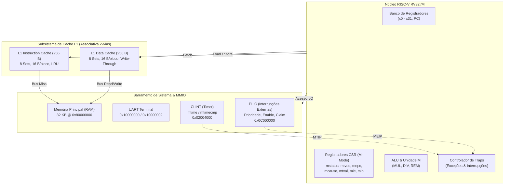

# Simulador RISC-V RV32I/M (Poxim-V)


-orange.svg?style=flat-square)


O **Poxim-V** é um emulador de processador com arquitetura **RISC-V de 32 bits (RV32I/M)** de alto desempenho, implementado em C puro (C99). O projeto foi concebido para modelar com fidelidade o ciclo de instrução, manipulação do estado arquitetural da CPU, subsistemas de traps síncronas e assíncronas, barramento de periféricos mapeados em memória (**MMIO**) e uma hierarquia de **memória cache L1 dividida (Harvard split)** com telemetria detalhada de taxa de acerto (*hit/miss rate*).

---

## 🏛️ Diagrama Arquitetural



---

## 🚀 Especificações Técnicas Suportadas

### 1. Conjunto de Instruções RV32I (Base Integer ISA)
- **Registradores**: 32 registradores de propósito geral de 32 bits (`x0` a `x31`, com `x0` permanentemente aterrado em zero) e `pc` (Program Counter).
- **Formatos de Instrução Decodificados**: R-Type, I-Type, S-Type, B-Type, U-Type e J-Type.
- **Aritmética e Lógica**:
  - Operações registrador-registrador: `add`, `sub`, `sll`, `slt`, `sltu`, `xor`, `srl`, `sra`, `or`, `and`.
  - Operações com imediato: `addi`, `slti`, `sltiu`, `xori`, `ori`, `andi`, `slli`, `srli`, `srai`.
- **Manipulação de Imediatos Superiores**: `lui` (Load Upper Immediate) e `auipc` (Add Upper Immediate to PC).
- **Controle de Fluxo**:
  - Saltos incondicionais: `jal` (Jump and Link) e `jalr` (Jump and Link Register).
  - Desvios condicionais: `beq`, `bne`, `blt`, `bge`, `bltu`, `bgeu`.
- **Acesso à Memória (Loads & Stores)**:
  - Leituras com extensão de sinal e zero: `lb`, `lh`, `lw`, `lbu`, `lhu`.
  - Escritas parciais e completas: `sb`, `sh`, `sw`.
- **Sincronização e Sistema**: `fence`, `fence.i`, `ecall`, `ebreak`.

### 2. Extensão RV32M (Multiplicação e Divisão por Hardware)
- **Multiplicação**:
  - `mul`: Parte baixa de 32 bits com ou sem sinal (\(R = [31:0](rs1 \times rs2)\)).
  - `mulh`: Parte alta de 64 bits com sinal (\(rs1\) signed, \(rs2\) signed).
  - `mulhsu`: Parte alta de 64 bits mista (\(rs1\) signed, \(rs2\) unsigned).
  - `mulhu`: Parte alta de 64 bits sem sinal (\(rs1\) unsigned, \(rs2\) unsigned).
- **Divisão e Resto**:
  - `div` e `divu`: Divisão com sinal e sem sinal, com tratamento estrito da norma RISC-V para divisão por zero (resultado \(-1\) ou \(2^{32}-1\)) e overflow com sinal (\(-2^{31} / -1 = -2^{31}\)).
  - `rem` e `remu`: Resto com sinal e sem sinal, com conformidade estrita para divisão por zero (retorna dividendo).

### 3. Modo Privilegiado e Registradores CSR (Machine Mode)
O processador emula a execução em **Modo Máquina (M-Mode)**, o nível de maior privilégio da arquitetura:
- **Registradores CSR Suportados**:
  - `mstatus`: Habilitação global de interrupções (`MIE`), salvamento de estado prévio (`MPIE`) e privilégio anterior (`MPP`).
  - `mtvec`: Vetor base de armadilhas, suportando modo direto (`MODE=0`) e modo vetorado (`MODE=1`).
  - `mepc`: Registrador de endereço de retorno de exceção.
  - `mcause`: Código identificador da causa da armadilha (bit 31 indica interrupção vs. exceção).
  - `mtval`: Valor complementar para depuração de faltas (endereço violado ou instrução falha).
  - `mie` / `mip`: Máscara e pendência individual de interrupções por hardware.
  - Contadores de telemetria: `mcycle`, `minstret`, `time` (e suas extensões de 64 bits `mcycleh`, `minstreth`, `timeh`).
- **Instruções de Controle de Estado**: `csrrw`, `csrrs`, `csrrwi` e a instrução de retorno de exceção `mret`.

### 4. Controlador de Armadilhas (Traps: Exceções & Interrupções)
- **Exceções Síncronas**:
  - Falha de instrução (`EXC_INST_FAULT` - causa 1).
  - Instrução ilegal (`EXC_ILLEGAL_INST` - causa 2).
  - Ponto de parada por software (`EXC_BREAKPOINT` - causa 3).
  - Falha de leitura/carga (`EXC_LOAD_FAULT` - causa 5).
  - Falha de escrita/armazenamento (`EXC_STORE_FAULT` - causa 7).
  - Chamada de ambiente (`ecall` em M-mode - causa 11).
- **Interrupções Assíncronas (Priorizadas)**:
  1. `MEIP` (Machine External Interrupt - causa `0x8000000B`): Gerenciada pelo controlador PLIC.
  2. `MSIP` (Machine Software Interrupt - causa `0x80000003`): Disparada por escrita via registrador de I/O rápido.
  3. `MTIP` (Machine Timer Interrupt - causa `0x80000007`): Temporizador periódico via comparação `mtime >= mtimecmp`.

### 5. Barramento e Periféricos MMIO (Memory-Mapped I/O)
- **UART / Terminal (`0x10000000` / `0x10000002`)**:
  - Transmissor/Receptor com buffer circular FIFO interno (loopback).
  - Saída direta para terminal padrão (`stdout`) no endereço `0x10000002` (TTY).
- **CLINT - Core Local Interruptor (`0x02000000` - `0x0200BFFF`)**:
  - Registrador de disparo de interrupção por software em `0x02000000`.
  - Temporizador de 64 bits com registradores `mtime` e comparador `mtimecmp` (`0x02004000` e `0x0200BFF8`).
- **PLIC - Platform-Level Interrupt Controller (`0x0C000000` - `0x0C2FFFFF`)**:
  - Controle de prioridade de linhas externas (`0x0C000028`).
  - Habilitação de interrupções (`0x0C002000`) e limiar de corte (*threshold*, `0x0C200000`).
  - Protocolo de requisição e confirmação (*Claim / Complete*, `0x0C200004`).

### 6. Hierarquia de Memória Cache L1
O simulador implementa uma arquitetura Harvard com memórias cache L1 dedicadas para instruções e dados:
- **Topologia**:
  - **Tamanho Total**: 256 bytes por cache.
  - **Tamanho do Bloco**: 16 bytes (4 palavras de 32 bits).
  - **Associatividade**: 2 vias (*2-way set associative*).
  - **Conjuntos**: 8 conjuntos por cache (16 linhas no total).
- **Políticas de Operação**:
  - **Política de Escrita**: *Write-Through* com *Write-Allocate* no acerto (*hit*) e *No-Write-Allocate* na falta (*miss*).
  - **Política de Substituição**: Menos Recentemente Utilizado (*LRU - Least Recently Used*) baseado na idade do acesso.
  - **Sincronização de Coerência**: Instrução `fence.i` para invalidação atômica de todas as linhas da ICache e reinicialização dos bits de validade.
- **Rastreamento e Telemetria**:
  - Registro de eventos em tempo de execução:
    - Leitura ICache: `#cache_mem:irh` (Hit) / `#cache_mem:irm` (Miss).
    - Leitura DCache: `#cache_mem:drh` (Hit) / `#cache_mem:drm` (Miss).
    - Escrita DCache: `#cache_mem:dwh` (Hit) / `#cache_mem:dwm` (Miss).
  - Estatísticas finais de desempenho: número total de acessos, acertos e taxa de acerto final (`hit rate` com precisão de 4 casas decimais).

---

## 📂 Estrutura do Repositório

```text
├── Makefile             # Automação de compilação, execução de testes e limpeza
├── README.md            # Documentação técnica e guia do projeto
├── .gitignore           # Regras de exclusão de artefatos de build e temporários
├── src/                 # Códigos-fonte em C do simulador
│   ├── poximv1.c        # Etapa 1: Core RV32I/M base e gerador de trace
│   ├── poximv2.c        # Etapa 2: Suporte a M-Mode, CSRs, Traps e MMIO
│   └── poximv3.c        # Etapa 3 (Final): Versão consolidada com Caches L1 I/D
└── tests/               # Vetores de teste, benchmarks e saídas de referência
    ├── terminal.s       # Benchmark em Assembly RISC-V (xorshift32, Heapsort, CRC32, I/O)
    ├── input.txt        # Imagem compilada em hexdump do benchmark padrão
    ├── excecao.txt      # Vetor de instruções para validação de exceções e traps
    ├── saida.txt        # Saída gerada pela execução da simulação
    └── esperado.txt     # Saída de referência para validação da execução
```

### Linha do Tempo e Evolução dos Módulos
1. **`poximv1.c` (Core RV32I/M)**: Núcleo do processador, decodificador de formatos R/I/S/B/U/J, banco de registradores e rastro sequencial de execução.
2. **`poximv2.c` (Privileged & MMIO)**: Adição do subsistema de interrupções/exceções em Modo Máquina, CSRs e periféricos mapeados (UART, CLINT, PLIC).
3. **`poximv3.c` (Full Processor with L1 Caches)**: Versão final completa que integra o processador RV32I/M com subsistema de memória cache L1 Harvard dividida, instruções `FENCE`/`FENCE.I` e métricas de taxa de acerto.

---

## 🛠️ Compilação e Execução

### Pré-requisitos
- Compilador C compatível com C99 (`gcc` ou `clang`).
- GNU Make 3.81 ou superior.

### Compilação via Makefile

Para compilar a versão final completa do simulador com otimização e checagens estritas:
```bash
make
# ou: make all
```
*O executável `poxim` será gerado na raiz e uma cópia armazenada no diretório `bin/`.*

Para compilar versões individuais da linha evolutiva:
```bash
make v1    # Gera bin/poximv1
make v2    # Gera bin/poximv2
make v3    # Gera poxim (versão final v3)
```

### Executando a Simulação

Para executar a simulação padrão com o benchmark de sistema:
```bash
make run
```
*Este comando roda o executável com `tests/input.txt` e salva o rastro de execução em `tests/saida.txt`, exibindo o banner ASCII transmitido pela porta serial MMIO do RISC-V.*

Para executar o teste do tratador de exceções:
```bash
make run-exc
```

Para validar a integridade da saída comparando as estatísticas finais:
```bash
make test
```

### Limpeza de Artefatos
Para remover binários compilados, objetos e saídas temporárias:
```bash
make clean
```

### Execução Manual Customizada
O binário compilado aceita dois parâmetros posicionais (arquivo de entrada em hexdump e arquivo de saída de trace):
```bash
./poxim <caminho_para_input.txt> <caminho_para_saida.txt>
```

Exemplo:
```bash
./poxim tests/input.txt tests/saida.txt
```

---

## 🧪 Benchmark Integrado (`tests/terminal.s`)

O repositório inclui um benchmark rigoroso implementado em Assembly RISC-V puro ([`tests/terminal.s`](file:///home/theo-enderson/Projetos/ARQUITETURA/tests/terminal.s)):
- **Rotinas de Memória**: Implementação otimizada de `memzero` e `strlen`.
- **Cálculo de Integridade**: Rotina de pseudo-CRC32 com mistura de bits por deslocamento e XOR.
- **Geração Pseudoaleatória**: Algoritmo `xorshift32` gerando vetores pseudoaleatórios a partir da semente `0xA5A5F00D`.
- **Ordenação em Memória**: Algoritmo `Heapsort` realizando *sift down* e trocas in-place de inteiros de 32 bits.
- **Transmissão MMIO**: Envio simultâneo da cadeia resultante para a UART (`0x10000000`) e para o terminal TTY (`0x10000002`).

---

## 📄 Licença

Este projeto é distribuído sob os termos da licença [MIT](LICENSE). Consulte o arquivo de licença para mais detalhes.
